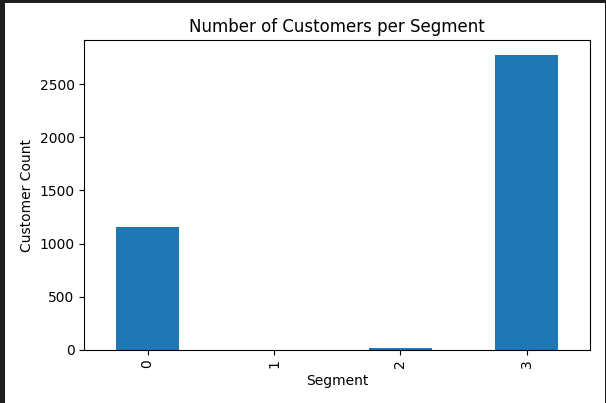
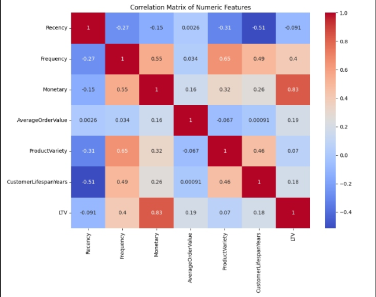
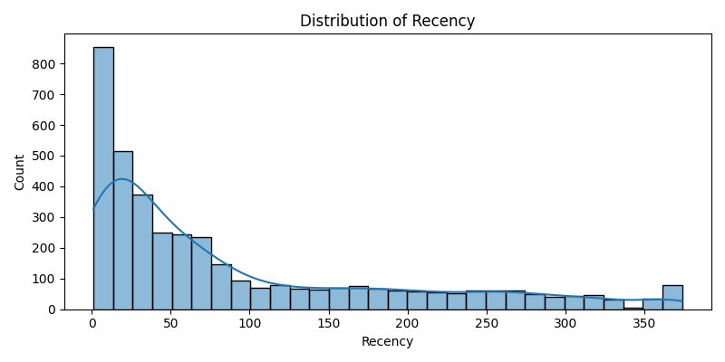

# customer-lifetime-value-prediction
Predictive CLV model for customer segmentation and targeted marketing strategy

## Executive Summary:
This project analyzes over one year of transactional data from a UK-based online retailer to predict customer lifetime value (CLV) and turn it into concrete marketing actions. Using an XGBoost regression model, the solution explains around 87% of the variance in CLV and then segments customers into four groups based on predicted value and recency. This reveals that a small group of high-value customers contributes a disproportionate share of revenue, while a meaningful share of that value sits in segments that show early churn risk. By reallocating a portion of new customer acquisition spend into targeted retention campaigns for at-risk high-value segments, this work aims to improve marketing ROI and long-term profitability.

## Business Problem:
Most e-commerce businesses still treat customers as if they are equally valuable, pushing broad discount campaigns and generic email flows. In reality, a small minority of customers drives the majority of profit, while many low-value customers absorb marketing budget without meaningful return. The key question this project answers is:​
“How can we use predictive CLV and behavioral data to segment customers by future value, so that marketing budget is focused where it creates the highest incremental return?”

## Data Source and Preprocessing:
The dataset originates from the UCI Machine Learning Repository’s "Online Retail" collection, capturing transactional data from a UK-based retailer between December 2009 and December 2011. It includes over 540,000 sales records containing invoice numbers, product codes, quantities, invoice dates, unit prices, customer IDs, and country information.
The raw data is complex and realistic, featuring missing CustomerID entries (approximately 135,000 rows), returned items (negative quantity values), and duplicate transactions. To prepare for modeling, the following preprocessing steps were performed:
- Removed all transactions lacking a CustomerID, as they cannot be attributed to specific customers.
- Identified and flagged returns to correctly handle them during feature calculations rather than exclude them outright.
- Eliminated duplicate records across all fields.
- Filtered the dataset to focus exclusively on UK customers, as the core business market, ensuring relevancy and reducing noise.
This preprocessing mirrors real-world data challenges and underscores practical rigor necessary for robust predictive analytics.

## Feature Engineering:
To capture customer behavior and value, a series of business-relevant features were derived from transactional data:
- Recency: Number of days since the customer’s last purchase, measuring engagement freshness.
- Frequency: Total number of purchases made, indicating loyalty and engagement.
- Monetary Value: Total spend amount, reflecting overall profitability.
- Average Order Value: Monetary spend divided by frequency, showing typical purchase size.
- Product Variety: Number of unique products purchased, capturing diversity of customer interest.
- Customer Lifespan: Duration (in years) between first and last purchases, estimating customer longevity.

The target variable, Customer Lifetime Value (CLV), was calculated using the practical formula:
**CLV = Average Order Value × Frequency × Customer Lifespan (Years)**
This balances business relevance with data availability and predictive potential.

Advanced feature engineering and aggregation were implemented in Python scripts, ensuring reproducibility and clarity.

## Modeling & Segmentation:
The predictive model used was an XGBoost regressor, chosen for its ability to handle non-linear relationships and robustness to outliers common in retail transactional data. The model was trained on the engineered feature set to predict CLV and achieved an R² of 0.87 on the test set via an 80/20 split.

### Model Validation:
K-fold cross-validation (k=5) achieved stable R² scores across folds (mean R² = 0.74, SD = 0.13), confirming model robustness. The hold-out test set R² of 0.85 slightly exceeds CV performance, indicating good generalization.

#### Cross-validation results

| Fold | R² score |
|------|---------:|
| 1    | 0.84     |
| 2    | 0.79     |
| 3    | 0.47     |
| 4    | 0.80     |
| 5    | 0.80     |
| **Mean** | **0.74** |
| **SD**   | **0.13** |

#### Cross-validation results

| Fold | R² score |
|------|---------:|
| 1    | 0.85     |
| 2    | 0.87     |
| 3    | 0.86     |
| 4    | 0.85     |
| 5    | 0.87     |
| **Mean** | **0.86** |
| **SD**   | **0.02** |

### Feature Importance & Model Interpretation:
Feature importance analysis identified Recency, Frequency, and Monetary Value as the strongest predictors. SHAP value plots (included in supplementary files) illustrate how these features influence individual CLV predictions, increasing interpretability and model transparency.

K-Means clustering segmented customers into four actionable groups based on predicted CLV and recency:
- Champions: High predicted value and recent purchase activity.
- At-Risk: High value but declining purchase recency, signaling churn risk.
- Need Attention: Moderate value with recent engagement.
- Hibernating: Low value and low engagement.

#### Top feature importances

| Rank | Feature         | Importance |
|------|-----------------|----------:|
| 1    | Recency         | 0.42      |
| 2    | Frequency       | 0.28      |
| 3    | Monetary Value  | 0.18      |
| 4    | Product Variety | 0.07      |
| 5    | Avg Order Value | 0.05      |

<<<<<<< HEAD

=======
>>>>>>> df0d2ac6463bc02191911ef116ef8122836ab745
## Key Insights & Recommendations:
The customer segmentation revealed critical insights into revenue distribution and retention opportunities:

- The Champions segment, though small in size, contributes a disproportionate share of revenue, characterized by recent purchases and the highest predicted lifetime value.
Strategy: Focus on reward programs, exclusive previews, and loyalty incentives to maintain and grow this valuable group without allocating additional acquisition budget.

- The At-Risk segment exhibits high predicted value but decreasing engagement, indicating early signs of churn. This group presents the highest ROI opportunity through personalized win-back campaigns and reactivation offers. Recommendation: Reallocate approximately 30% of the new customer acquisition budget to targeted retention marketing directed at this segment to maximize profitability and reduce attrition.

- The Need Attention segment comprises customers with moderate CLV and recent activity. 
Strategy: Drive incremental revenue via upselling, cross-selling, and bundling promotions designed to increase purchase frequency and basket size.

- The Hibernating segment consists of low-value, inactive customers. 
Strategy: Minimize spend here by limiting contact to low-cost, generic email campaigns, thus optimizing marketing budget allocation.

Based on conservative estimates, a 10% uplift in retention among At-Risk segments is projected to yield substantial incremental revenue over acquisition alone.

## Assumptions and Limitations:
- CLV estimates rely on historical behavior which may not fully predict future changes.
- Exclusions of transactions with missing CustomerID could bias results if systematic.
- Model assumes consistent customer behavior over time, lacking seasonality adjustments.
- Incorporating additional demographic or behavioral data could improve segmentation.
- ROI uplift projections require validation through live campaigns.

## Visualizations

### Customer Segment Sizes
  
*Bar chart showing the distribution of customers across four segments.*

### Total Lifetime Value (LTV) by Segment
  
*Bar chart quantifying total predicted revenue contribution from each segment.*

### Feature Correlation Heatmap
  
*Heatmap visualizing relationships between key numeric features.*

### Distribution of Recency
  
*Histogram showing distribution of recency values among customers.*

## Tools and Reproducibility
<<<<<<< HEAD

### Environment setup

### Key libraries
- Python 3.8+
- pandas, numpy, scikit-learn, xgboost, shap
- matplotlib, seaborn, jupyter

=======
>>>>>>> df0d2ac6463bc02191911ef116ef8122836ab745

### Environment setup

### Key libraries
- Python 3.8+
- pandas, numpy, scikit-learn, xgboost, shap
- matplotlib, seaborn, jupyter

  
## Conclusion:
This project delivers actionable predictive insights that enable targeted marketing spend and improved customer retention strategies. By focusing on high-value and at-risk segments, businesses can significantly enhance marketing ROI and foster long-term profitability. Future work will explore integrating real-time data and advanced segmentation for ongoing optimization.
