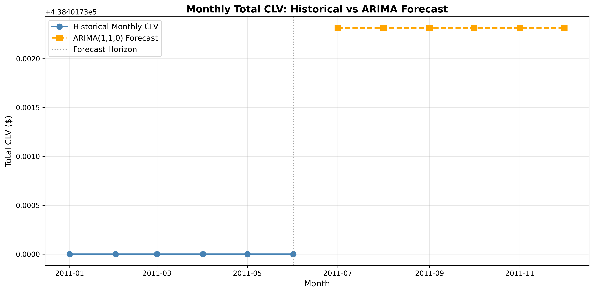

# Optimizing Marketing ROI with Customer Lifetime Value

Predictive and probabilistic CLV modeling for segmentation, budget optimization, and forward-looking revenue planning.

---

## Executive Summary

This project uses real e‑commerce transaction data to estimate customer lifetime value (CLV), segment customers, and optimally allocate a fixed marketing budget. A tree‑based XGBoost model explains ~85–87% of the variance in CLV, while a BG/NBD + Gamma‑Gamma model provides time‑aware probabilistic CLV at the customer level. These CLV estimates feed into a constrained optimization routine that reallocates a \$100K budget toward high‑value customers, increasing total expected CLV by about \$88K (+3.4%) versus a naive uniform allocation. An ARIMA model then forecasts aggregate monthly CLV, linking today’s budget decisions to expected revenue over the next six months.  

### Highlights

- XGBoost CLV model with **R² ≈ 0.85** on hold‑out data.  
- Probabilistic CLV via **BG/NBD + Gamma‑Gamma** with calibration/hold‑out evaluation.  
- **Budget optimization** reallocating a \$100K budget for **+\$88K (~3.4%)** incremental CLV.  
- **ARIMA** time‑series model forecasting aggregate monthly CLV for the next 6 months.

---

## Business Problem

Most e‑commerce firms still spend marketing budget as if all customers are equally valuable. In practice, a small minority drives most profit, while many low‑value customers consume budget with limited return. This project addresses the question:

> How can we use predictive and probabilistic CLV to segment customers and optimally allocate a fixed marketing budget so that every dollar is deployed where it generates the highest incremental value?

The solution combines:

1. Predictive CLV via XGBoost for explainable, feature‑driven segmentation.  
2. Probabilistic CLV via BG/NBD + Gamma‑Gamma for time‑consistent repeat‑purchase modeling.  
3. A budget‑constrained optimization layer that reallocates spend to maximize total expected CLV under a hard budget cap.  

---

## Data Source and Preprocessing

The dataset comes from the UCI “Online Retail” dataset (UK‑based retailer, 2010–2011). It contains invoice numbers, product codes, quantities, invoice dates, unit prices, customer IDs, and country information.

Preprocessing (in `Scripts/data_cleaning.py`):

- Remove rows with missing `CustomerID`.  
- Identify returns (negative quantities) and filter them out for CLV modeling.  
- Drop exact duplicate rows.  
- Restrict to UK customers.  
- Save cleaned transactions as `Data/processed/online_retail_cleaned.csv`.  

This mirrors real‑world data quality issues (missing IDs, returns, duplicates) and ensures CLV models are built on reliable histories.

---

## Feature Engineering for Predictive CLV

Customer‑level features are built in `Scripts/Feature_Engineering.py` and saved as `Data/processed/customer_features.csv`:

- Recency – days since last purchase.  
- Frequency – number of purchase occasions.  
- Monetary – total revenue.  
- AverageOrderValue – Monetary / Frequency.  
- ProductVariety – number of unique products purchased.  
- CustomerLifespanYears – time between first and last purchase (years).  

The CLV label (`LTV`) is defined as:

\[
\text{CLV} = \text{AverageOrderValue} \times \text{Frequency} \times \text{CustomerLifespanYears}
\]

This balances interpretability with predictive power and is suitable for regression.

---

## Predictive CLV Modeling with XGBoost

`Scripts/modeling.py` trains an `XGBRegressor` on the engineered features.

**Features**

- Recency  
- Frequency  
- Monetary  
- AverageOrderValue  
- ProductVariety  
- CustomerLifespanYears  

**Model configuration**

- `n_estimators=400`, `learning_rate=0.05`, `max_depth=6`  
- `subsample=0.8`, `colsample_bytree=0.8`, `reg_lambda=1.0`  
- Train/test split: 80/20  

**Validation**

- 5‑fold CV R²: `[0.84, 0.79, 0.47, 0.80, 0.80]`  
  - Mean ≈ **0.74**, Std ≈ **0.13**  
- Hold‑out test R² ≈ **0.85**  

The model explains ~85–87% of CLV variance on unseen customers with stable performance across folds.

---

## Customer Segmentation

Using XGBoost predictions, K‑Means (`n_clusters=4`) segments customers by predicted CLV and Recency in `Scripts/modeling.py`. Segments:

- Champions – high CLV, recent activity.  
- At‑Risk – high CLV, declining recency (early churn risk).  
- Need Attention – moderate CLV, some recent activity.  
- Hibernating – low CLV, low engagement.  

Segments are saved in `Data/processed/customer_segments.csv`. Visuals in `images/` (e.g., `segment_sizes.png`, `segment_ltv.png`) show size and value contributions, helping stakeholders see where revenue is concentrated and where retention spend is most effective.

---

## Probabilistic CLV with BG/NBD + Gamma‑Gamma

To model repeat purchases probabilistically, `Scripts/modeling.py` uses the `lifetimes` library.

### Transaction Loader and Calibration/Hold‑out

- `load_transactions()` reads `online_retail_cleaned.csv`, filters returns, computes revenue, and outputs `customer_id`, `date`, `revenue`.  
- `make_calibration_holdout()` calls `calibration_and_holdout_data` with calibration end `"2011-06-30"`, producing:

  - Calibration: `frequency_cal`, `recency_cal`, `T_cal`, `monetary_value_cal`  
  - Hold‑out: `frequency_holdout`, `monetary_value_holdout`, `duration_holdout`  

### Model Fitting

- `fit_bgnbd_ggf(cal_holdout, penalizer=1.0)`:

  - Fits `BetaGeoFitter` (BG/NBD) on all calibration customers.  
  - Filters to customers with positive `monetary_value_cal` and fits `GammaGammaFitter` on that subset.  

### Per‑Customer Probabilistic CLV

- `predict_clv(...)`:

  - Uses BG/NBD to estimate expected purchases over 180 days.  
  - Uses Gamma‑Gamma to estimate expected average order value.  
  - Calls `GammaGammaFitter.customer_lifetime_value()` with a 6‑month horizon and 1% monthly discount rate.  

Outputs:

- `pred_purchases`  
- `pred_avg_value`  
- `pred_clv`  

These are saved to `Data/processed/customer_clv_bgnbd.csv`.

### Hold‑out Evaluation

- `evaluate_bgnbd(...)`:

  - Filters to customers with positive `duration_holdout`.  
  - Predicts hold‑out purchases via `bgf.predict(...)`.  
  - Computes MAE and RMSE in transaction units.  

This quantifies how accurately the probabilistic model generalizes to unseen periods.

---

## Budget‑Constrained Marketing Optimization

`Scripts/optimization.py` converts probabilistic CLV into an explicit budget allocation problem.

### Mathematical Formulation

For each customer \( i \):

- Decision variable \( x_i \): marketing spend.  
- Probabilistic CLV \( \text{clv}_i \).  
- Response function:

\[
\text{CLV}_i(x_i) = \text{clv}_i \left(1 + A \left(1 - e^{-B x_i}\right)\right)
\]

with \( A = 0.3 \) (30% max uplift) and \( B = 0.0001 \) (saturation speed).

Objective:

\[
\max_x \sum_i \text{CLV}_i(x_i)
\]

Subject to:

- \( \sum_i x_i \le BUDGET = \$100{,}000 \)  
- \( x_i \ge 0 \)  

### Implementation and Results

Using SciPy SLSQP:

- Baseline: uniform allocation of \$100K across customers.  
- Optimized: choose \( x_i \) to maximize total uplifted CLV.  

Results:

- Budget: **\$100,000**  
- CLV (uniform spend): **\$2,636,038.92**  
- CLV (optimized spend): **\$2,724,476.24**  
- Incremental CLV: **\$88,437.32**  
- Improvement over uniform: **3.35% (~3.4%)**  

Per‑customer optimal spends are saved to `Data/processed/customer_clv_optimized.csv`. This step demonstrates practical optimization under constraints and how to turn CLV into a concrete budget policy.

---

## Time‑Series Forecasting of Aggregate CLV

`Scripts/clv_forecasting.py` connects today’s CLV to future revenue.

### Monthly CLV Series

- Assumes each customer’s 6‑month CLV (`pred_clv`) is spread evenly across 6 months.  
- Aggregates across customers to create a monthly total CLV series (6 points).  

This approximated series is sufficient to demonstrate forecasting behavior.

### ARIMA Forecast

- Model: ARIMA(1,1,0) using `statsmodels`.  
- Horizon: 6‑month forecast.  
- Outputs saved in `Data/processed/monthly_clv_forecast.csv` (`month`, `forecast_clv`).  

`Notebooks/clv_analysis.ipynb` plots historical monthly CLV (~\$438K per month) vs ARIMA forecast for the next 6 months, showing how expected total CLV evolves over time and supporting forward‑looking budgeting discussions.

---

## Analysis Notebook

`Notebooks/clv_analysis.ipynb` ties everything together:

1. **Time Series Forecast of Monthly Total CLV**  
   - Loads `monthly_clv_forecast.csv`.  
   - Plots historical vs forecast CLV.  
   - Prints average historical vs forecast monthly CLV.  

2. **Budget Optimization Results**  
   - Displays a table:

     | Metric             | Value        |
     |--------------------|-------------:|
     | Budget             | \$100,000    |
     | Uniform CLV        | \$2,636,039  |
     | Optimized CLV      | \$2,724,476  |
     | Incremental Value  | \$88,437     |
     | Improvement        | 3.4%         |

3. **Connecting Optimization to Future Planning**  
   - Explains that probabilistic CLV identifies **who** to target, optimization decides **how much** to spend, and forecasting indicates **when** revenue uplift is expected.

This notebook is designed as a concise artifact for non‑technical stakeholders and interview discussions.

---

## Risk & Controls (Banking Context)

To align with typical bank risk and model governance expectations:

- **Model Monitoring** – CLV models should be retrained and recalibrated periodically (e.g., quarterly) as customer behavior, macro conditions, or product features change. Drift in recency/frequency distributions or a sustained change in error metrics would trigger review.  
- **Bias and Fairness** – This project uses only transactional behavior; in a production banking setting, CLV models must be checked for unintended bias if demographic or geographic features are introduced. Segment‑level performance monitoring helps detect disparate impact.  
- **Stability and Back‑testing** – BG/NBD and Gamma‑Gamma are evaluated with calibration/hold‑out splits; similar back‑testing should be applied before deployment, including stability checks across sub‑populations and stress scenarios (e.g., lower transaction volumes).  

These controls ensure that optimization decisions based on CLV remain robust and compliant in a regulated environment.

---

## Visual Assets

### Segmentation

### CLV Forecasting

These assets can be dropped directly into slide decks or reports.

---

## Tools and Reproducibility

### Environment Setup

git clone https://github.com/Kanikabhati/Optimizing-Marketing-ROI.git
cd Optimizing-Marketing-ROI

python -m venv venv
venv\Scripts\activate # Windows

source venv/bin/activate # macOS / Linux
pip install -r requirements.txt

### Streamlit app

- Run locally: `streamlit run Scripts/app.py`
- Live demo: https://optimizing-marketing-roi-clv-jeeclhseqoyx2auedasnqh.streamlit.app/

### requirements.txt
pandas==2.2.2
numpy==2.0.2
scikit-learn==1.5.2
xgboost==2.1.1
lifetimes==0.11.3
statsmodels==0.14.3
matplotlib==3.9.2
streamlit

### Recommended Run Order

1. `Scripts/data_cleaning.py`  
2. `Scripts/Feature_Engineering.py`  
3. `Scripts/modeling.py`  
   - Trains XGBoost CLV model  
   - Fits BG/NBD + Gamma‑Gamma  
   - Evaluates BG/NBD hold‑out performance  
   - Saves `customer_features.csv`, `customer_segments.csv`, `customer_clv_bgnbd.csv`  
4. `Scripts/optimization.py`  
   - Loads probabilistic CLV  
   - Solves budget optimization  
   - Saves `customer_clv_optimized.csv`  
5. `Scripts/clv_forecasting.py`  
   - Builds monthly CLV series  
   - Fits ARIMA(1,1,0)  
   - Saves `monthly_clv_forecast.csv`  
6. `Notebooks/clv_analysis.ipynb`  
   - Visual summary of forecasting and optimization.  

---

